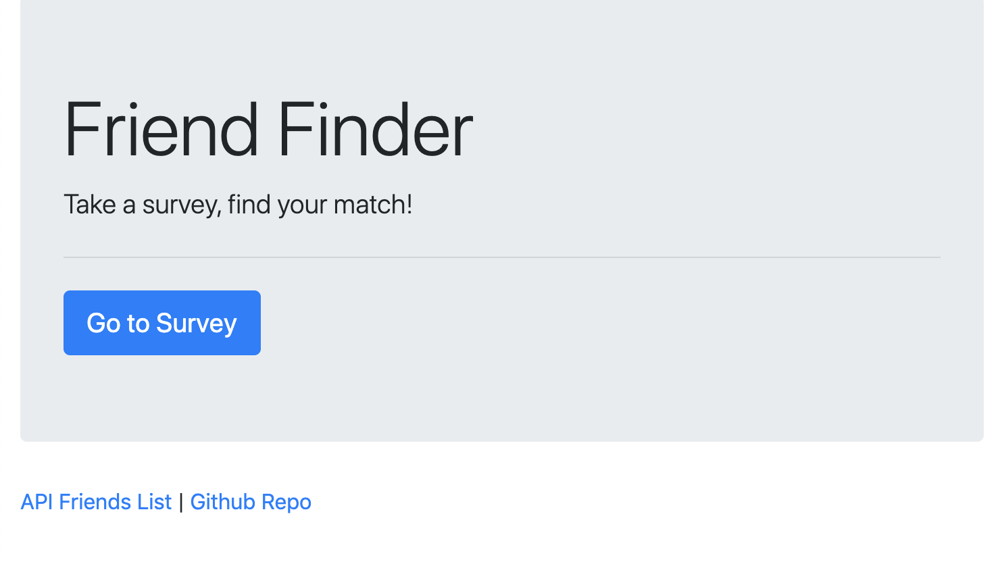
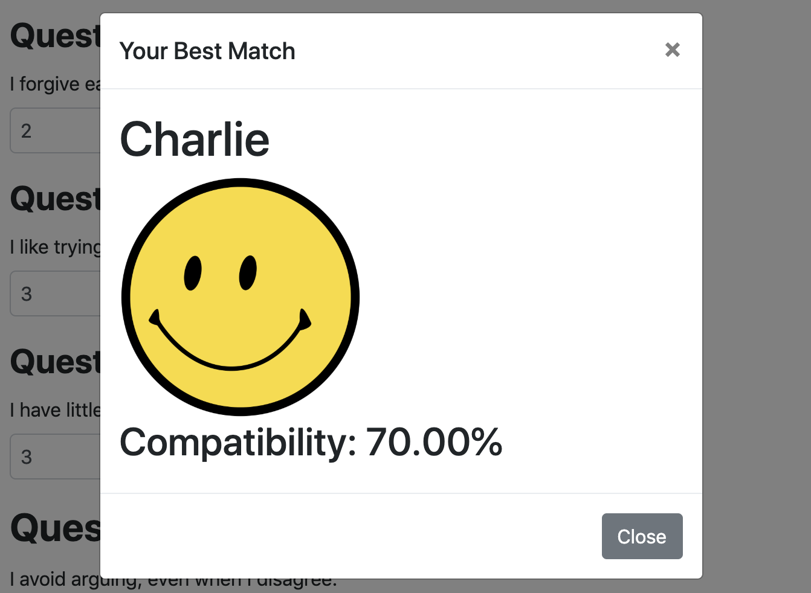

# Friend-Finder
Friend Finder app that tests compatibility amongst users using Node and Express

Upon page load, users will be greeted with the following home screen:

Clicking on the "Go to Survey" button will bring the user to a page with a 10-question survey. The user will be required to fill out their name, add a link to their photo, and answer all 10 questions. Each question is in the form of a statement, which the user will need to rate on a scale from 1 - 5: 1 being that they strongly disagree with the statement, and 5 being that they strongly agree with the statement.

Once the user clicks the submit button, a modal will pop up with information about another user that has the most similar range of answers to their own. Their name, photo, and compatibility percentage are displayed. The higher the percentage, the more compatible the users are with each other.

Clicking on the API Friends List link on either page will display information on all users that have completed the survey in a form of a JSON object.